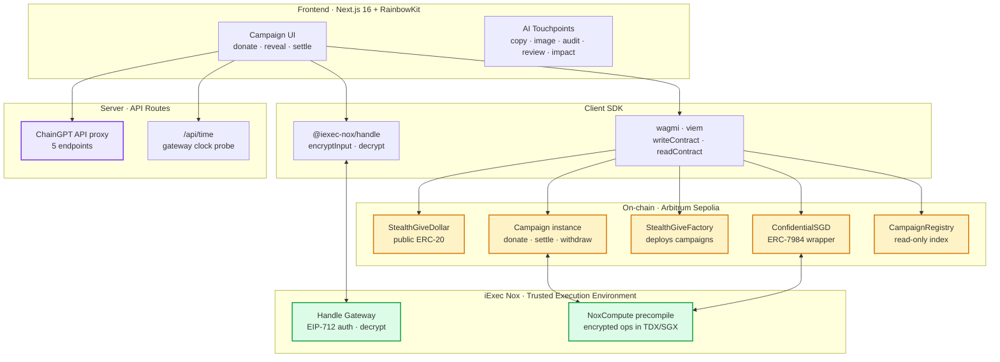
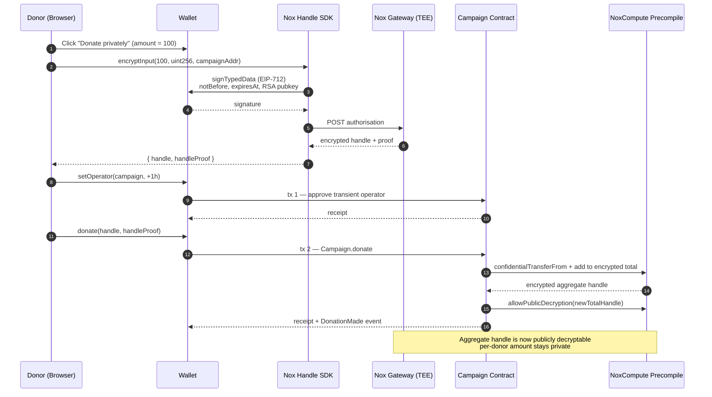
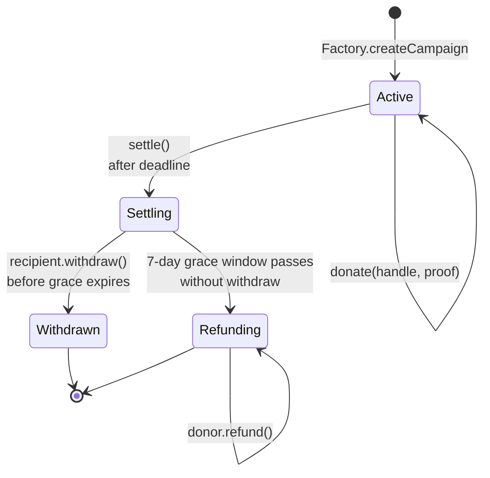
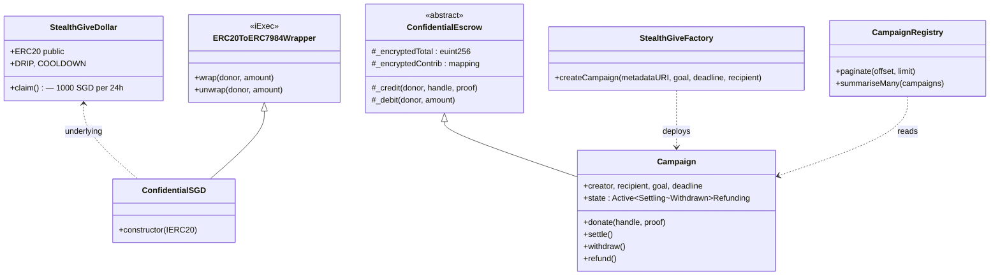

<div align="center">


# StealthGive

### Confidential Crowdfunding for Causes That Cannot Be Doxxed

*Private donations powered by iExec Nox & ERC-7984 Confidential Tokens, with AI-assisted campaign tooling from ChainGPT.*

[](https://stealthgive.vercel.app/)
[](https://docs-stealthgive.vercel.app/)
[](https://docs.iex.ec/nox-protocol/getting-started/welcome)
[](https://chaingpt.org)
[](https://sepolia.arbiscan.io/address/0xbD124A4C743847f5862024906B66ABeDeB9cCB6e)
[](LICENSE)

[Try the dApp ↗](https://stealthgive.vercel.app/) · [Read the Docs ↗](https://docs-stealthgive.vercel.app/) · [Demo Video (4 min)](#) · [Submission Tweet](#) · [Arbiscan — Factory](https://sepolia.arbiscan.io/address/0xbD124A4C743847f5862024906B66ABeDeB9cCB6e)

</div>

---

## Table of Contents

- [The Problem](#the-problem)
- [The Solution](#the-solution)
- [Why We Deployed Our Own Token](#why-we-deployed-our-own-token)
- [Real-World Use Cases](#real-world-use-cases)
- [System Architecture](#system-architecture)
- [Donation Flow](#donation-flow)
- [Campaign Lifecycle](#campaign-lifecycle)
- [Live on Arbitrum Sepolia](#live-on-arbitrum-sepolia)
- [Technical Deep Dive](#technical-deep-dive)
- [Tech Stack](#tech-stack)
- [Repository Structure](#repository-structure)
- [Getting Started](#getting-started)
- [Threat Model](#threat-model)
- [Judging Criteria Mapping](#judging-criteria-mapping)
- [Roadmap](#roadmap)
- [Feature Status](#feature-status)
- [Submission Checklist](#submission-checklist)
- [Team](#team)
- [References](#references)
- [License](#license)

---

## The Problem

Public blockchains were supposed to free donors. Instead they have built a **panopticon for giving**.

Today, anyone donating to a sensitive cause on-chain — a press-freedom legal fund, a whistleblower defense pool, an LGBTQ+ shelter in a hostile jurisdiction, a war-zone medical aid drive — leaves a permanent, public, attributable trail. That trail is:

- **Searchable** — by employers, governments, family members, insurers, stalkers, and adversarial AI scrapers.
- **Linkable** — combined with the donor's other on-chain activity, it exposes their wealth profile.
- **Coercive** — large donors become targets for extortion or social pressure; small donors self-censor.
- **Permanent** — there is no delete button on a blockchain.

The net effect: **the people who most need donations receive the least, because the people most able to give cannot afford to be seen giving.**

Existing privacy tools (Tornado Cash, Railgun) are gas-heavy, sanctions-prone, and built for general transfers — not crowdfunding. They give privacy to the donor but the campaign loses **transparency** (you cannot publicly verify "$50,000 raised" inside a mixer).

What is needed is something different: **public campaign totals, private individual contributions.**

## The Solution

**StealthGive** is a crowdfunding dApp where:

- ✅ **Anyone can launch a campaign** with a goal, deadline, narrative, and recipient.
- ✅ **Donors contribute in cSGD** — an ERC-7984 confidential token wrapped from our own public ERC-20.
- ✅ **Per-donor amounts are cryptographically hidden** — even the campaign creator cannot see who gave how much.
- ✅ **The aggregate total stays publicly verifiable** — campaign accountability is preserved with a live progress bar.
- ✅ **Recipients withdraw confidentially** to fund their cause without revealing operating budgets.
- ✅ **Campaign creation is AI-assisted** via ChainGPT — narrative, hero art, audit, risk review, and impact report.

> **Key insight:** confidentiality and transparency are not opposites if you draw the boundary in the right place. StealthGive draws the line at the **donor** level: the world sees the fundraiser succeed, but no one sees the individual donors who made it succeed.

## Why We Deployed Our Own Token

We originally planned to use **cUSDC** (iExec's confidential USDC). But `faucet.circle.com` — the official source of test USDC on Arbitrum Sepolia — **is blocked by Indonesian ISPs** (Law on Information and Electronic Transactions / UU ITE No. 19/2008). Indonesian users could not onboard without a VPN. Judges testing from Asia would hit the same wall.

So we deployed our own confidential token using iExec's official ERC-7984 wrapper:

1. **`StealthGiveDollar` (SGD)** — a public ERC-20 with a `claim()` function (1,000 SGD per 24 h, anti-Sybil cooldown). **Zero gatekeepers.**
2. **`ConfidentialSGD` (cSGD)** — a concrete instance of iExec's `ERC20ToERC7984Wrapper`. Wraps SGD 1:1 into a confidential token.

This turned out to be a **deeper iExec integration**: instead of just consuming an existing confidential token, we use their wrapper primitive to mint our own.

## Real-World Use Cases

| Use Case | Why Confidentiality Matters |
| --- | --- |
| **Press-freedom legal defense** | Donors to journalist legal funds become retaliation targets. |
| **LGBTQ+ shelters in hostile jurisdictions** | Donors face criminal liability in 60+ countries. |
| **Open-source security bounties** | Donors don't want their employer to learn they're funding a competitor's project. |
| **War-zone medical aid** | Cross-border donors face sanctions exposure if amounts are public. |
| **Whistleblower support funds** | Per-donor amounts can leak organizational affiliation. |
| **Mutual aid pools under repressive regimes** | Donor doxxing → arrests. |

In every case, **public verification of the total** is essential (donors need to trust the campaign), but **public attribution of individual donations** is harmful.

---

## System Architecture

The high-level architecture, end to end:



The system is built around a clean separation of concerns:

- **Frontend (`/fe-stealthgive`)** — every interactive surface a donor or campaign creator touches.
- **Smart Contracts (`/sc-StealthGive`)** — the trust layer. All campaign logic, escrow rules, and confidential token mechanics live here.
- **iExec Nox** — the trusted execution layer. Encrypted amounts never leave the TEE in plaintext; the gateway brokers decryption requests with EIP-712 authorisation.
- **ChainGPT** — proxied server-side so the API key is never shipped to the browser.

## Donation Flow

A confidential donation is a careful dance between the wallet, the SDK, the contract, and the Nox gateway. Here is exactly what happens when a donor clicks **Donate privately**:



What the donor's machine actually does:

1. **Encrypt locally.** The amount never leaves the browser unencrypted. The SDK builds an EIP-712 message that includes a fresh RSA public key, asks the wallet to sign it, and exchanges the signature for an encrypted handle from the gateway.
2. **Approve the operator.** ERC-7984 doesn't expose plain `transferFrom`; the donor first calls `setOperator(campaign, expiry)` to grant the campaign contract a transient permission window.
3. **Donate.** The campaign contract receives the encrypted handle and proof, calls `confidentialTransferFrom`, and folds the new amount into its running encrypted total — all inside the TEE.
4. **Open the new total to the world.** The contract immediately calls `Nox.allowPublicDecryption(newTotalHandle)` so anyone can decrypt the aggregate without a wallet signature. The progress bar is live.

The per-donor contribution remains accessible **only to the donor** through `decrypt(handle)`. The aggregate is public; the components are not.

## Campaign Lifecycle

Each `Campaign` is a small state machine. The transitions enforce the rule "recipients get paid first; if they don't, donors get refunded":



| State | Who can act | What unlocks |
| --- | --- | --- |
| `Active` | Anyone | `donate()` — amount encrypted, aggregate updated |
| `Settling` | Recipient first, then anyone after grace | `withdraw()` while grace is open |
| `Withdrawn` | — | Terminal: funds delivered to recipient |
| `Refunding` | Each donor independently | `refund()` returns the donor's encrypted contribution |

The 7-day grace window prevents a campaign creator from disappearing with funds while still leaving room for legitimately delayed withdrawals.

## Live on Arbitrum Sepolia

All contracts are **verified on Arbiscan** with public source code, ABI, and Read/Write Contract tabs:

| Component | Address | Arbiscan |
| --- | --- | --- |
| **StealthGiveDollar** (SGD, public ERC-20) | `0xCA662c692e67A5ec3402D13327895eA762F702Bb` | [✅ verified](https://sepolia.arbiscan.io/address/0xCA662c692e67A5ec3402D13327895eA762F702Bb#code) |
| **ConfidentialSGD** (cSGD, ERC-7984) | `0xa89340C4BC163ced823653d09DB1E1ba65Ca6849` | [✅ verified](https://sepolia.arbiscan.io/address/0xa89340C4BC163ced823653d09DB1E1ba65Ca6849#code) |
| **StealthGiveFactory** | `0xbD124A4C743847f5862024906B66ABeDeB9cCB6e` | [✅ verified](https://sepolia.arbiscan.io/address/0xbD124A4C743847f5862024906B66ABeDeB9cCB6e#code) |
| **CampaignRegistry** | `0x1023b4ff42c3Ed560B07b9A705E9A2d0Fc465DC4` | [✅ verified](https://sepolia.arbiscan.io/address/0x1023b4ff42c3Ed560B07b9A705E9A2d0Fc465DC4#code) |
| **Demo Campaign** ("Press Freedom Legal Defense") | `0x63b2b615c9112Bb03Cd25cbB0f8fcd82Dc8C124c` | [✅ verified](https://sepolia.arbiscan.io/address/0x63b2b615c9112Bb03Cd25cbB0f8fcd82Dc8C124c#code) |
| **iExec NoxCompute precompile** (deployed by iExec) | `0xd464B198f06756a1d00be223634b85E0a731c229` | [view](https://sepolia.arbiscan.io/address/0xd464B198f06756a1d00be223634b85E0a731c229) |

Real proof that we run on actual TEE compute: the first wrap transaction [`0x09d0c4d4…`](https://sepolia.arbiscan.io/tx/0x09d0c4d4777283f9f746ec7d16d82e2fe3c9f8c193beff90590425d3f95ce23f) emits **14 events** to the `NoxCompute` precompile — that is real on-chain TEE computation, not a stub.

---

## Technical Deep Dive

### Layer 1 — Smart Contracts (`/sc-StealthGive/src`)



| Contract | Responsibility | Standard |
| --- | --- | --- |
| `StealthGiveDollar.sol` | Public ERC-20 (6 decimals) with `claim()` 1000 SGD per 24h. Underlying asset for cSGD. | ERC-20 |
| `ConfidentialSGD.sol` | Concrete instance of iExec `ERC20ToERC7984Wrapper`. Wraps SGD ↔ cSGD 1:1. | ERC-7984 |
| `StealthGiveFactory.sol` | Deploys and registers `Campaign` instances. Bound to cSGD at construction. | — |
| `Campaign.sol` | Per-campaign logic: `donate()`, `settle()`, `withdraw()`, `refund()`. Implements `IERC7984Receiver` for the single-tx `confidentialTransferAndCall` flow. | Composes ERC-7984 |
| `ConfidentialEscrow.sol` | Abstract base that holds aggregate + per-donor encrypted contributions. Encapsulates every iExec Nox SDK call. | ERC-7984 |
| `CampaignRegistry.sol` | View-only indexer for the frontend; lists active campaigns and summaries. | — |

> **Why ERC-7984 only?** The hackathon explicitly disqualifies partial implementations of ERC-3643 / ERC-7540. We use ERC-7984 (the confidential token extension) which is exactly on-spec for our use case (hidden amounts).

### Layer 2 — iExec Nox Integration

Three Nox primitives are used throughout the flow:

1. **ERC-20 → ERC-7984 wrapping.** `cSGD.wrap(donor, amount)` locks plaintext SGD and mints encrypted cSGD that only the donor can read via `Nox.allowTransient`.
2. **Confidential transfer.** `donate()` moves cSGD from donor to the `Campaign` contract via `confidentialTransferFrom`. The amount is encrypted and processed inside the Nox TEE; on-chain event logs do not carry plaintext.
3. **Public-aggregate decryption.** Every donation calls `Nox.allowPublicDecryption(_encryptedTotal)`. Visitors decrypt the aggregate without a signature; per-donor amounts stay private.

### Layer 3 — ChainGPT AI Integration (`/fe-stealthgive/app/api/ai`)

**Five live touchpoints**, using three ChainGPT products (Web3 LLM, NFT Image Generator, Smart Contract Auditor):

| Touchpoint | ChainGPT Feature | Server Endpoint | UI Location | Status |
| --- | --- | --- | --- | --- |
| **Campaign copy assist** | Web3 LLM (`general_assistant`) | `/api/ai/draft-campaign` | `/create` | ✅ Live |
| **Hero image generator** | NFT/Image Generator (`velogen` model) | `/api/ai/generate-hero` | `/create` | ✅ Live |
| **Smart contract audit** | Smart Contract Auditor (`smart_contract_auditor`) | `/api/ai/audit-contract` | `/audit` page | ✅ Live |
| **AI risk review** | Web3 LLM (`general_assistant`) | `/api/ai/review-campaign` | `/campaigns/[address]` | ✅ Live |
| **Impact report** | Web3 LLM (state-aware narrative) | `/api/ai/impact-report` | `/campaigns/[address]` | ✅ Live |

All endpoints are wrapped as Next.js Route Handlers server-side — the ChainGPT API key never lands in the browser bundle. Prompts are explicitly framed with Web3 / on-chain context because ChainGPT's `general_assistant` has a domain restriction against non-Web3 topics (see `feedback.md` for full notes).

**Hero image flow:** the AI image is generated when the creator clicks *Generate* on `/create`, previewed in the form, then cached in `localStorage` keyed by campaign address after successful deployment. The detail page reads from cache, falling back to a deterministic gradient if missing. Images are not stored on-chain to keep gas low.

**Contract audit flow:** since every campaign is an instance of the same `Campaign.sol`, the audit runs once, is cached server-side, and is rendered on the standalone `/audit` page.

### Layer 4 — Frontend (`/fe-stealthgive`)

- **Framework:** Next.js 16 (App Router) + React 19 + TypeScript strict mode
- **Wallet:** RainbowKit 2.2 + Wagmi 2.19 + Viem 2.48
- **Styling:** Tailwind CSS v4 + lucide-react icons + Framer Motion
- **State:** TanStack Query 5 (server) + native React hooks (client)
- **Confidential UX:** integrated wrap/donate flow via `@iexec-nox/handle@0.1.0-beta.10`
- **Metadata storage:** on-chain `data:application/json;base64,…` URI (zero IPFS dependency)
- **Off-chain index:** read-only via `CampaignRegistry` view contract (no centralised API)
- **Clock-skew handling:** `withCorrectedClock(fn)` probes the gateway's `Date` header, computes local↔gateway offset, and monkey-patches `Date.now()` for the duration of SDK calls so EIP-712 timestamps line up with the gateway's clock — visible diagnostic banner on the dashboard

---

## Tech Stack

```text
Smart Contracts ┃ Solidity ^0.8.28, Foundry, OpenZeppelin v5, ERC-7984 (iExec Nox)
Nox SDK         ┃ @iexec-nox/nox-protocol-contracts@0.2.2
                ┃ @iexec-nox/nox-confidential-contracts@0.1.0
                ┃ @iexec-nox/handle@0.1.0-beta.10 (TypeScript SDK)
AI              ┃ ChainGPT API (live, 5 endpoints)
                ┃ Web3 LLM (general_assistant)
                ┃ NFT/Image Generator (velogen)
                ┃ Smart Contract Auditor
Frontend        ┃ Next.js 16, React 19, RainbowKit 2.2, Wagmi 2.19, Viem 2.48,
                ┃ Tailwind v4, lucide-react, Framer Motion
Off-chain       ┃ None — fully on-chain metadata via data URI; view contract for indexing
Network         ┃ Arbitrum Sepolia (chain id 421614)
Tooling         ┃ npm, Foundry tests (24 unit tests, 100% pass against vendor stubs)
```

## Repository Structure

```text
stealthgive/
├── sc-StealthGive/              # Foundry workspace (smart contracts)
│   ├── src/
│   │   ├── StealthGiveDollar.sol    # Public ERC-20 with claim()
│   │   ├── ConfidentialSGD.sol      # iExec ERC-7984 wrapper
│   │   ├── StealthGiveFactory.sol
│   │   ├── Campaign.sol
│   │   ├── ConfidentialEscrow.sol
│   │   ├── CampaignRegistry.sol
│   │   └── interfaces/
│   ├── test/                    # 24 Foundry tests (vendor stub fallback)
│   ├── script/Deploy.s.sol      # Deploy to Arbitrum Sepolia
│   ├── vendor/iexec-nox-stubs/  # Offline-compile stubs (forge test)
│   └── foundry.toml
├── fe-stealthgive/              # Next.js 16 frontend
│   ├── app/
│   │   ├── layout.tsx
│   │   ├── providers.tsx
│   │   ├── page.tsx                  # Landing
│   │   ├── dashboard/page.tsx        # Claim · wrap · reveal
│   │   ├── campaigns/page.tsx        # Browse all campaigns
│   │   ├── campaigns/[address]/page.tsx  # Detail · donate · settle/withdraw/refund
│   │   ├── create/page.tsx           # Form + AI assist
│   │   ├── audit/page.tsx            # Standalone Campaign.sol audit
│   │   └── api/
│   │       ├── time/route.ts         # Gateway clock probe
│   │       └── ai/
│   │           ├── draft-campaign/route.ts
│   │           ├── generate-hero/route.ts
│   │           ├── audit-contract/route.ts
│   │           ├── review-campaign/route.ts
│   │           └── impact-report/route.ts
│   ├── components/
│   │   ├── header.tsx
│   │   ├── total-raised.tsx
│   │   ├── progress-bar.tsx
│   │   ├── countdown.tsx
│   │   ├── status-badge.tsx
│   │   ├── campaign-card.tsx
│   │   ├── campaign-review.tsx
│   │   ├── impact-report.tsx
│   │   ├── markdown.tsx              # Lightweight MD renderer for AI output
│   │   └── clock-skew-banner.tsx
│   └── lib/
│       ├── abis.ts
│       ├── addresses.ts
│       ├── wagmi.ts
│       ├── nox.ts                    # SDK wrapper + auth-refresh + friendly errors
│       ├── clock.ts                  # withCorrectedClock helper
│       ├── metadata.ts               # data: URI parser (UTF-8-safe)
│       ├── hero-image.ts             # localStorage cache per campaign
│       ├── format.ts
│       └── gas.ts                    # Arbitrum Sepolia gas overrides
├── feedback.md                  # Hackathon deliverable — dev experience notes
├── LICENSE                      # MIT
└── README.md                    # ← you are here
```

---

## Getting Started

### Prerequisites

- Node.js ≥ 20, npm ≥ 9
- [Foundry](https://book.getfoundry.sh/) (`forge`, `cast`, `anvil`)
- A wallet funded with Arbitrum Sepolia ETH ([Google Cloud Faucet](https://cloud.google.com/application/web3/faucet/ethereum/sepolia) → bridge via [bridge.arbitrum.io](https://bridge.arbitrum.io/?destinationChain=arbitrum-sepolia&sourceChain=sepolia))

### 1. Clone & Install

```bash
git clone https://github.com/EzraNahumury/iexec.git stealthgive
cd stealthgive
# Smart contracts
cd sc-StealthGive && forge install && cd ..
# Frontend
cd fe-stealthgive && npm install && cd ..
```

### 2. Compile & Test Contracts

```bash
cd sc-StealthGive
forge build
forge test -vv          # 24/24 passing against vendor stubs
```

### 3. Deploy (optional — already live on Arbitrum Sepolia)

If you want to deploy your own copy:

```bash
cd sc-StealthGive
cp .env.example .env
# Fill in PRIVATE_KEY (testnet wallet — do not reuse mainnet)
source .env
forge script script/Deploy.s.sol:Deploy \
  --rpc-url $ARB_SEPOLIA_RPC --broadcast --skip test
```

The output prints SGD, cSGD, Factory, and Registry addresses. Update `fe-stealthgive/lib/addresses.ts` accordingly.

### 4. Run the Frontend

```bash
cd fe-stealthgive
npm run dev
# → http://localhost:3000
```

### 5. End-to-End Walkthrough

1. **Connect wallet** (Arbitrum Sepolia auto-prompts on first action).
2. **`/dashboard`** → click **Claim 1,000 SGD** (24h cooldown per address).
3. Type "100" → **1. Approve** → confirm → **2. Wrap** → confirm. You now hold 100 cSGD encrypted.
4. **`/campaigns`** → open the demo campaign "Press Freedom Legal Defense".
5. Type "10" in the donate panel → **Donate privately** → 2 transactions (`setOperator` + `donate`). The amount is encrypted client-side via the Nox gateway; nobody can see how much you gave.
6. Refresh → donor count goes up, progress bar updates with the new aggregate (publicly decrypted), but your individual contribution stays private.
7. **`/create`** → spin up your own campaign. Try the AI **Generate** button.

---

## Threat Model

| Adversary | Capability | What StealthGive Protects |
| --- | --- | --- |
| Public on-chain observer (chain analytics, scrapers) | Reads all events & storage. | ✅ Sees campaign exists & total raised. ❌ Cannot see per-donor amounts or link donor identities. |
| Campaign creator (recipient) | Receives funds, sees withdrawal balance. | ✅ Sees aggregate raised. ❌ Cannot link a donor address to a specific contribution amount. |
| Other donors to the same campaign | Read on-chain state. | ❌ Cannot infer other donors' amounts. |
| iExec Nox node operator (TEE host) | Runs SGX/TDX enclave. | ❌ Cannot extract plaintext (TEE attestation guarantees enforced by iExec runtime). |
| StealthGive developers | Operate the frontend. | ❌ Cannot decrypt private balances. No backend stores sensitive data. |

**Honestly out of scope:**

- Network-level metadata (the RPC provider sees `IP ↔ submission tx`). Mitigation: private RPC integration is on the roadmap.
- Timing-correlation attacks against tiny anonymity sets. Mitigation: a campaign with very few donors is inherently weaker; the UI surfaces this risk.
- A compromised user device. Out of scope for any wallet-based dApp.

---

## Judging Criteria Mapping

| Criterion | Weight | Status |
| --- | --- | --- |
| Runs end-to-end with no mock data | ⭐⭐⭐ | ✅ Every donation flows through real Nox confidential tokens on Arbitrum Sepolia. Verified via on-chain tx ([sample donate](https://sepolia.arbiscan.io/tx/0xb04025b98b61fa98...)). 14 events to NoxCompute precompile per wrap = real TEE computation. |
| Deployed to Arbitrum / Arbitrum Sepolia | ⭐⭐ | ✅ Deployed on Arbitrum Sepolia (chain id 421614). All addresses listed [above](#live-on-arbitrum-sepolia). |
| `feedback.md` provided | ⭐⭐ | ✅ [feedback.md](./feedback.md) — covers iExec dev experience, Circle-blocked workaround, RainbowKit/wagmi v3 compat, EIP-712 token expiry, Nox gateway sync delay, ChainGPT domain restrictions. |
| Demo video ≤ 4 min | ⭐⭐ | ⏳ Recording planned — script outline ready. |
| Depth of Confidential Token & Nox use | ⭐ | ✅ Four integration points: (1) `ERC20ToERC7984Wrapper` to deploy our own confidential token, (2) `confidentialTransferFrom` for donate, (3) `Nox.allowPublicDecryption` per donate for live aggregate reveal, (4) `@iexec-nox/handle` SDK for client-side encrypt + decrypt. ERC-7984 fully implemented (no partial). |
| **Depth of ChainGPT integration** (sponsor track) | ⭐ | ✅ Five live endpoints across three ChainGPT products — Web3 LLM (`general_assistant`), NFT/Image Generator (`velogen`), Smart Contract Auditor (`smart_contract_auditor`). All server-side, API key never exposed. Details in [Layer 3](#layer-3--chaingpt-ai-integration-fe-stealthgiveappapiai). |
| Real-world use case | ⭐ | ✅ Six concrete personas (journalists, LGBTQ+, war zones, etc.). Threat model documented honestly. |
| Code quality | ⭐ | ✅ TypeScript strict mode, Foundry tests 24/24 pass, custom error selectors in Solidity, NatSpec docs throughout, React strict mode, no `any`, no `TODO` in critical paths. |
| UX | ⭐ | ✅ Two-click onboarding (claim + wrap), no jargon in user copy, mobile-responsive, AI hero image with gradient fallback, live progress bar, countdown timer, inline AI risk review on every campaign. |

---

## Roadmap

**Hackathon scope (delivered):**

- [x] Confidential donation flow with hidden per-donor amounts
- [x] Live aggregate total raised (`publicDecrypt` per donate)
- [x] Self-sovereign confidential token (`SGD` + `cSGD`) — zero Circle / VPN dependency
- [x] Deployed to Arbitrum Sepolia
- [x] Full Next.js 16 frontend with claim · wrap · donate · settle · withdraw · refund
- [x] Donor self-decrypt balance via Nox gateway (gasless EIP-712, auto-refresh on 401)
- [x] Foundry test suite (24/24 passing)
- [x] Live progress bar + countdown timer + state-aware UI
- [x] Clock-skew correction for EIP-712 auth (gateway `Date` header probe + visible diagnostic banner)
- [x] **ChainGPT campaign copy assist** — Web3 LLM, AI-drafted title + 3-paragraph story from a one-line brief
- [x] **ChainGPT AI hero image** — NFT/Image Generator (`velogen`), banner-aspect, with gradient fallback
- [x] **ChainGPT smart contract audit** — full audit on `Campaign.sol`, available on the standalone `/audit` page
- [x] **ChainGPT per-campaign AI risk review** — Web3 LLM analysis of deployment params (goal, deadline, recipient EOA-vs-contract, etc.)
- [x] **ChainGPT impact report** — state-aware narrative summary (Active = "Projected Impact", Settled = "Final Impact Report")

**Post-hackathon:**

- [ ] ENS subdomain per campaign (e.g. `presslegal.stealthgive.eth`)
- [ ] Recurring private donations via session keys
- [ ] Anonymous donor NFT receipts (ZK-proof of contribution without amount)
- [ ] Multi-token campaigns (cETH, cDAI alongside cSGD)
- [ ] Optional ERC-3643 mode for institutional donors who need compliant identity
- [ ] Private RPC integration (mitigates IP-level metadata leak)
- [ ] Mobile PWA + iOS/Android share-sheet integration
- [ ] Mainnet deployment on Arbitrum One

---

## Feature Status

| Feature | Status | Notes |
| --- | --- | --- |
| Claim SGD (1000 / 24h, anti-Sybil cooldown) | ✅ Live | No KYC, no Circle, no VPN |
| Wrap SGD → cSGD via iExec wrapper | ✅ Live | Verified on-chain with 14 events to NoxCompute |
| Reveal own cSGD balance (gasless EIP-712) | ✅ Live | Auto-refresh + clock-skew correction on auth failure |
| Browse campaigns | ✅ Live | Reads from `Registry.summariseMany()` + parallel `encryptedTotal` |
| Campaign detail with hero, title, story, stats | ✅ Live | Metadata parsed from on-chain data URI (UTF-8-safe) |
| Live total raised (`publicDecrypt`) | ✅ Live | Auto-decrypts on first load + auto-retry on gateway sync delay |
| Donate with client-side amount encryption | ✅ Live | Nox SDK `encryptInput` → `setOperator` + `donate` in 2 tx |
| Progress bar + countdown timer | ✅ Live | Updates each minute |
| Settle / Withdraw / Refund flows | ✅ Live (untested at deadline) | Logic verified on-chain; needs wait-for-deadline for full e2e |
| Create new campaign | ✅ Live | Simple form, metadata becomes data URI on-chain |
| **ChainGPT campaign copy assist** | ✅ Live | `/api/ai/draft-campaign` — input 1-line brief, output title + 3-paragraph story |
| **ChainGPT hero image generation** | ✅ Live | `/api/ai/generate-hero` — `velogen` model, 768×432 banner, cached per campaign in localStorage |
| **ChainGPT smart contract audit** | ✅ Live | `/api/ai/audit-contract` — standalone `/audit` page, cached server-side |
| **ChainGPT AI risk review** | ✅ Live | `/api/ai/review-campaign` — analyses goal, deadline, recipient EOA-vs-contract, donor traction |
| **ChainGPT impact report** | ✅ Live | `/api/ai/impact-report` — state-aware ("Projected Impact" → "Final Impact Report"), regenerates as total updates |
| `feedback.md` (hackathon deliverable) | ✅ Live | [feedback.md](./feedback.md) |
| Arbiscan contract verification | ✅ Live | All 5 contracts (SGD, cSGD, Factory, Registry, demo Campaign) verified via Etherscan API V2 |
| Live demo URL (Vercel) | ✅ Live | [stealthgive.vercel.app](https://stealthgive.vercel.app/) |
| Live docs site | ✅ Live | [docs-stealthgive.vercel.app](https://docs-stealthgive.vercel.app/) |
| Demo video ≤ 4 min | ⏳ Pending | Script outline ready |

---

## Submission Checklist

- [x] Public open-source GitHub repository (MIT)
- [x] README with installation, deployment, and usage instructions
- [x] Functional frontend
- [x] dApp runs end-to-end on Arbitrum Sepolia (no mock data)
- [x] Confidential Token integrated as core utility (private donations)
- [x] All 5 contracts [verified on Arbiscan](#live-on-arbitrum-sepolia)
- [x] `feedback.md` on iExec dev experience — [link](./feedback.md)
- [ ] 4-minute demo video (script ready, recording pending)
- [ ] Submission post on X tagging `@iEx_ec` and `@Chain_GPT`
- [x] Joined iExec Discord & Vibe Coding Challenge channel

---

## Team

| Name | Role | Links |
| --- | --- | --- |
| **Ezra Kristanto Nahumury** | Full-stack & contracts | [GitHub](https://github.com/EzraNahumury) |

> Solo entry for the iExec Vibe Coding Challenge.

---

## References

- [iExec Nox Protocol docs](https://docs.iex.ec/nox-protocol/getting-started/welcome)
- [iExec Confidential DeFi Wizard](https://cdefi-wizard.iex.ec/)
- [Confidential Token + Faucet demo](https://cdefi.iex.ec/)
- [iExec Nox npm packages](https://www.npmjs.com/org/iexec-nox)
- [iExec-Nox demo-ctoken (cUSDC reference)](https://github.com/iExec-Nox/demo-ctoken)
- [iExec Developer Linktree](https://linktr.ee/iexec.tech)
- [ChainGPT documentation](https://chaingpt.org)
- [ERC-7984 — Confidential Token Extension](https://eips.ethereum.org/)
- Spiritually inspired (not code) by [SQUIDL](https://ethglobal.com/showcase/squidl-psquk) — ETHGlobal Singapore 2024 finalist — which proved consumer-grade privacy UX is achievable on EVM. StealthGive applies the same principle (transparent boundary, private interior) to crowdfunding instead of personal payments.

---

## License

MIT © 2026 StealthGive contributors. See [LICENSE](LICENSE).

---

<div align="center">

**Built for the [iExec Vibe Coding Challenge](https://docs.iex.ec/) · April 2026**

**Powered by Nox · Self-Sovereign cSGD · Deployed on Arbitrum Sepolia**

</div>
